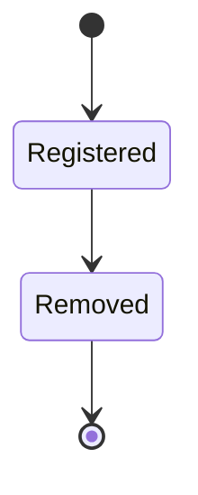

# Provider Interface

## Purpose

Defines the common interface every provider — local or cloud, for every
capability domain — must implement so that NOVA Core never contains
provider-specific logic, per `docs/15-decisions/adr-0008-v5-architecture-evolution.md`.This is the generalization of the pattern `docs/05-ai/model-providers.md`
already established for LLM providers, applied to every capability
domain in `capability-management.md`.

## Scope

The interface contract and lifecycle. Domain-specific request/response
shapes live in each domain's own doc (e.g. speech-to-text shapes in
`docs/22-voice/local-speech-models.md`). Which provider gets picked for a
given call is `provider-routing.md`.

## Capability domains

Each domain defines its own request/response schema but shares the same
provider lifecycle:

| Domain | Examples |
|---|---|
| LLM (text generation) | local GGUF model, OpenAI-compatible endpoint, Anthropic, etc. |
| Vision | local VLM, cloud vision API |
| Speech-to-Text | Whisper (local), Sarvam, cloud STT API |
| Text-to-Speech | Coqui (local), cloud TTS API |
| Embeddings | local embedding model, cloud embedding API |
| OCR | local OCR engine, cloud OCR API |
| Reranking | local cross-encoder, cloud rerank API |
| Messaging channel | Telegram, Discord, WhatsApp, Slack, etc. |
| Remote control transport | Tailscale, other WireGuard-based mesh |

Adding a new domain means adding a row here and an interface definition
below — it never means adding a branch inside the Planner or Executor.

## The interface contract

Every provider, regardless of domain, implements:

```
interface Provider {
  provider_id: string
  domain: CapabilityDomain
  privacy_class: "local" | "cloud"

  describe(): ProviderDescriptor        // capabilities, limits, cost model
  healthCheck(): HealthStatus           // reachable / degraded / down
  invoke(request: DomainRequest): DomainResponse | Stream<DomainChunk>
  cancel(requestId): void
  shutdown(): void
}
```

- `describe()` is what the Capability Registry uses to populate the setup
  wizard's provider picker and the routing policy's filter/rank step —
  it is the single source of truth for "what can this provider do,"
  never a hardcoded list maintained elsewhere. `ProviderDescriptor`
  includes a `schema_version` field (the domain request/response schema
  version this provider adapter implements, per that domain's own doc)
  so the router can detect a mismatch before invoking, rather than
  discovering it as a runtime schema-validation failure.
- `invoke()` accepts and returns the domain's typed schema. NOVA Core code
  that calls a capability is written against the domain schema, never
  against a specific provider's native API shape — provider-specific
  translation lives entirely inside that provider's adapter.

## Version negotiation

Before invoking a provider, the router compares the request's required
domain-schema version against that provider's advertised
`schema_version` from `describe()`. A provider advertising a lower
version than the router requires is either downgraded to (if the
provider's adapter supports serving an older schema shape) or excluded
from the candidate list for that call, per `docs/25-failure-modes/FM-04-model-router-provider-fallback.md`'s FM-04-015 — this check happens
before invocation, never as a reactive response to a schema-validation
failure at runtime.
- Streaming domains (LLM, STT, TTS, voice) return a `Stream<DomainChunk>`
  so low-latency, interrupt-capable interaction (per
  `docs/22-voice/voice-assistant.md`) is a first-class return type, not a
  bolt-on.

## Registration

A provider is registered by:

1. Implementing the interface for its domain.
2. Providing a manifest (`provider.manifest.json`) declaring `provider_id`,
   `domain`, `privacy_class`, required credentials (referenced, never
   inline — see `credential-management.md`), and hardware requirements if
   local.
3. Passing the same sandboxing and permission review as any plugin
   (`docs/16-extensibility/plugin-sandboxing.md`,
   `docs/10-security/permissions.md`) — a provider is a plugin from the
   sandbox's point of view, with a narrower, typed interface.

No code path in NOVA Core is permitted to `import` a provider SDK
directly. All access goes through the interface, resolved at runtime by
the Capability Registry.

## Lifecycle



A provider entry has exactly two lifecycle states: **Registered**
(manifest validated, sandboxing/permission review passed) and
**Removed** (`shutdown()` called or manifest withdrawn; terminal — a
later re-add is a new registration). This is distinct from the live
`healthCheck()` status (`reachable` / `degraded` / `down`, per the
interface contract above), which fluctuates continuously while a
provider is `Registered` and does not itself change the lifecycle
state — a `degraded` or `down` provider is still `Registered` and still
subject to the fallback chain in `provider-routing.md`; it is only
`Removed` when explicitly shut down or withdrawn.

`down` is not set directly by a single failed health-check poll — it is
the observable result of that provider's circuit breaker being `Open` or
`HalfOpen`, per the canonical breaker definition in
`docs/26-system-reference/19-ordering-concurrency-and-retry-rules.md`
(trips after 5 consecutive failures, 60s cooldown). `degraded` is the
separate, breaker-independent signal for elevated latency/error-rate
that has not crossed that trip threshold
(`docs/25-failure-modes/FM-04-model-router-provider-fallback.md`'s
FM-04-018) — the two are never conflated: a provider is `degraded` only
while its breaker is still `Closed`.

## Failure and fallback

Every domain request carries an optional fallback chain
(`provider-routing.md`). If `invoke()` throws or `healthCheck()` reports
down, the router advances to the next eligible provider in the chain
without the caller needing to know a failure occurred, unless no
provider remains, in which case the typed error propagates.

## Related documents

- `docs/25-failure-modes/FM-04-model-router-provider-fallback.md` — failure modes for this subsystem
- `docs/05-ai/model-providers.md`, `docs/05-ai/model-router.md` — the
  original LLM-specific instance of this pattern
- `capability-management.md` — the registry that tracks provider
  instances per domain
- `provider-routing.md` — selection and fallback policy
- `docs/16-extensibility/plugin-architecture.md` — the shared plugin
  substrate providers are built on
