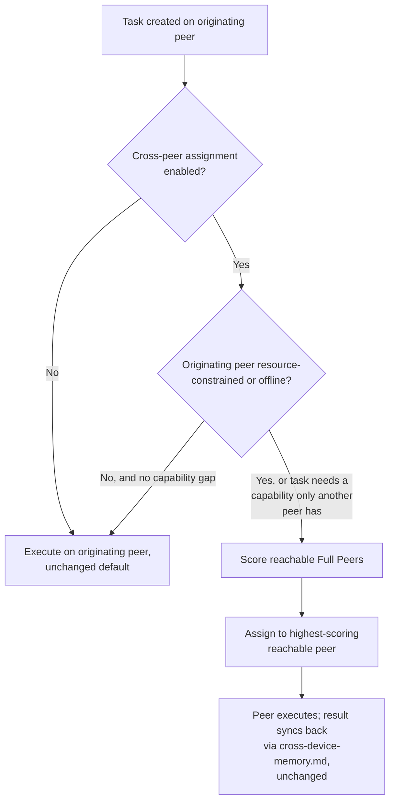

# Distributed Task Scheduling

## Purpose

Specifies how a Task is assigned to a specific device when a user has
more than one **Full Peer** device (`multi-device-architecture.md`)
paired — a gap that document explicitly leaves open, stating only that
"execution itself continues on whichever device (typically the Primary
Runtime) originally started it." That default is sufficient for a single
always-on desktop plus companions, but says nothing about *choosing*
between two or more Full Peers, or about resource-aware load balancing
across them.

## Scope

Peer selection and load-aware assignment for a Task among Full Peers
only. Companion devices (`android-companion.md`) never execute
Planner/Executor logic locally and are out of scope here, unchanged from
`multi-device-architecture.md`. Memory/state sync mechanics thisscheduling relies on are `cross-device-memory.md`, not repeated here.

## Default: originating device

Consistent with the existing default, a Task assigned no other way
executes on whichever Full Peer the request originated from (voice,
chat, or a Companion's forwarded request). This document specifies the
**exceptions** to that default — the cases where a different Full Peer
is a better choice and the user has enabled cross-peer assignment (off
by default; see Boundaries).

## When reassignment is considered

Reassignment is considered, never forced, in two cases only:

- **Resource constraint** — the originating peer is under sustained load
  beyond `docs/11-performance/resource-usage.md`'s budget for accepting
  new work, and a reachable peer is not.
- **Capability gap** — the task requires a local-only capability
  (`docs/18-providers/`) that only exists on a specific paired peer (a
  GPU-bound local model, a peripheral only attached to one machine), in
  which case that peer is the assignment regardless of load.

## Peer scoring

When more than one Full Peer is eligible, candidates are scored on:
current resource headroom (`docs/11-performance/resource-usage.md`),
reachability (a peer that is offline or degraded per
`multi-device-architecture.md`'s failure-mode handling is excluded, not
scored low), and capability match (a peer possessing a required local
capability scores above one that would need to fall back to a cloud
provider for the same step, per `docs/18-providers/provider-routing.md`'s
existing local-preferred routing philosophy applied here at the peer
level rather than the model level). This reuses existing signals; it does
not introduce a new resource-monitoring mechanism beyond what
`resource-usage.md` already tracks per device.

## Assignment is a placement decision, not a fork

Exactly one peer executes a given Task at a time — cross-peer scheduling
never runs the same Task redundantly on multiple peers for speed or
reliability. This keeps the Task state machine
(`docs/03-runtime/task-manager.md`) unchanged: a Task has one owning
device at any point in its lifecycle, tracked as an additional field on
the existing Task record and synced like any other Task-state field
(`cross-device-memory.md`).

## Mid-task peer failure

If the peer executing a Task becomes unreachable mid-execution, the Task
enters the existing `Failed` state's retry path
(`docs/03-runtime/task-manager.md`) exactly as a single-device failure
would; retry, if attempted, re-runs peer scoring rather than assuming the
same peer, since the condition that caused unreachability may persist.
This does not introduce a new recovery mechanism — it is
`docs/03-runtime/failure-recovery.md`'s existing retry path, with peer
selection as an additional input each retry re-evaluates.

## Boundaries

- **Off by default.** A user with multiple Full Peers keeps the simple
  originating-device default until they explicitly enable cross-peer
  assignment in Settings — this avoids surprising a user who expects a
  task started on their laptop to run on their laptop.
- **Never reassigns a Task already at the WaitingUser or a
  confirmation-pending state** (`docs/03-runtime/task-manager.md`) — a
  Task waiting on a confirmation the user is about to give on a specific
  device is not silently moved elsewhere.
- **No new trust boundary.** Peer assignment only ever selects among
  devices already paired under the same NOVA identity
  (`multi-device-architecture.md`'s Identity section) — it never
  introduces a device outside that trust boundary as an execution target.

## Related documents

- `docs/25-failure-modes/FM-10-desktop-android-distributed-sync.md` — failure modes for this subsystem
- `multi-device-architecture.md` — pairing, topology, and the default
  this document adds exceptions to
- `cross-device-memory.md` — the sync mechanism that makes a Task's
  progress and result visible regardless of which peer executed it
- `docs/03-runtime/task-manager.md` — the Task state machine this
  document adds a device-assignment field to, without altering the
  states themselves
- `docs/11-performance/resource-usage.md` — the resource-headroom signal
  used for scoring
- `docs/18-providers/provider-routing.md` — the local-preferred routing
  philosophy this document applies at the peer level
