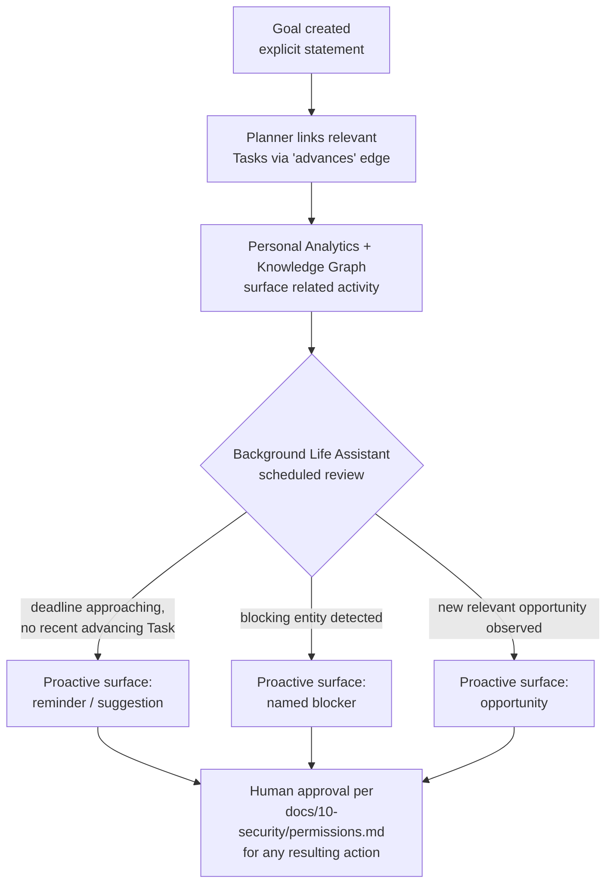

# Goal Tracking

## Purpose

Specifies how NOVA represents and proactively works toward a **durable,
multi-week-or-longer objective** the user states once — "graduate in
Japan," "launch the v2 site by Q3," "get to a 5k without walking" — as
distinct from a Task (a single bounded unit of execution,
`docs/03-runtime/task-manager.md`) and from the Background Life Assistant
(`background-life-assistant.md`, which prepares recurring *daily*
context but does not track progress toward a standing objective across
weeks or months). This document closes that gap.

## Scope

Goal representation, progress inference, and proactive surfacing of
blockers/opportunities/deadlines related to a goal. It does not introduce
a new execution mechanism — advancing a goal still happens through
ordinary Tasks and, where multi-step, the Workflow Engine
(`docs/17-workflow/workflow-engine.md`); this document is the layer that
decides *when* to propose or take those actions in service of a
longer-horizon objective the user is not actively supervising task by
task.

## The Goal entity

A Goal is a first-class Knowledge Graph node (`docs/04-memory/ontology.md`
v2): statement, status (`active` / `blocked` / `achieved` / `abandoned`),
an optional target date, and a created timestamp. A Goal is created only
from an explicit user statement ("I want to graduate in Japan by next
spring") or an explicit user confirmation of a proposed Goal NOVA
inferred from repeated related activity — never silently inferred and
acted on without confirmation, consistent with
`docs/23-autonomy/adaptive-personalization.md`'s "no hidden state the
user cannot inspect" posture.

## How progress is tracked

A Goal's progress is not a single computed percentage — it is a
retrievable set of Tasks and Decisions linked to it via the `advances`
edge (`docs/04-memory/ontology.md` v2), so "how is this goal going" is
answered by showing the actual linked activity through the existing
Retrieval Fusion Engine (`docs/04-memory/retrieval-engine.md`), not a
separate, opaque scoring model.

## Detecting blockers and opportunities

This capability does not add new observation sources. It runs, on the
same Job Scheduler cadence as `background-life-assistant.md`'s briefing
job, a retrieval query per active Goal against the Knowledge Graph and
Memory for:

- **Deadlines** — calendar events or explicitly stated dates connected to
  the Goal or its linked Tasks (`docs/21-channels/calendar-assistant.md`)
  approaching without a recent advancing Task.
- **Blockers** — an entity explicitly marked with a `blocks` edge to the
  Goal (a stalled Task, an unanswered email awaiting a required document,
  a Decision still pending) — a blocker is only ever recorded via an
  explicit signal (the user naming it, or a Task ending in a documented
  failure state that names its cause), never inferred silently from
  Task absence alone, since silence is ambiguous and absence is not
  evidence of blockage.
- **Opportunities** — new information observed through connected channels
  or observers that plausibly relates to the Goal (e.g., a scholarship
  deadline mentioned in an email, while pursuing a "study abroad" Goal),
  surfaced as a suggestion citing its source, never acted on directly.

## Boundaries

- **Proactive surfacing only — never proactive irreversible action.**
  Exactly as `background-life-assistant.md` already establishes for
  briefings, goal-tracking's proactive layer drafts and surfaces; any
  resulting action (sending an email, registering for something, booking
  a flight) passes through the normal confirmation gate
  (`docs/10-security/permissions.md`) at its usual risk tier.
- **No goal invents sub-tasks the user did not approve.** NOVA can
  *suggest* a Task that would advance a Goal; it does not add a Task to
  the Task Manager's active queue without the same confirmation step any
  other Planner-initiated Task requires.
- **Bounded frequency, fully disable-able**, on the same footing as
  `background-life-assistant.md`'s frequency controls — goal-tracking
  reviews run on the Job Scheduler, not as a constant background process,
  and can be turned off per-Goal or entirely from Settings.
- **A Goal is not a KPI-optimization target.** Progress surfacing
  describes linked activity; it does not score the user against the Goal
  in a way that could function as pressure or a guilt mechanism — this
  follows the same "usefulness, not engagement" boundary
  `adaptive-personalization.md` sets for proactive timing generally.

## Related documents

- `docs/25-failure-modes/FM-18-autonomy-policy-approval.md` — failure modes for this subsystem
- `docs/04-memory/ontology.md` (v2) — the Goal node and `pursues` /`advances` / `blocks` edges this document relies on - `background-life-assistant.md` — the scheduling and briefing-delivery
  mechanism goal reviews reuse rather than duplicate
- `docs/03-runtime/task-manager.md` — Tasks, the unit that actually
  advances a Goal
- `docs/17-workflow/workflow-engine.md` — for goals whose advancing work
  requires branching/parallel execution
- `docs/10-security/permissions.md` — the unchanged confirmation gate for
  any action a goal review proposes
- `personal-analytics.md` — the retrospective data feed goal reviews
  query alongside the Knowledge Graph
