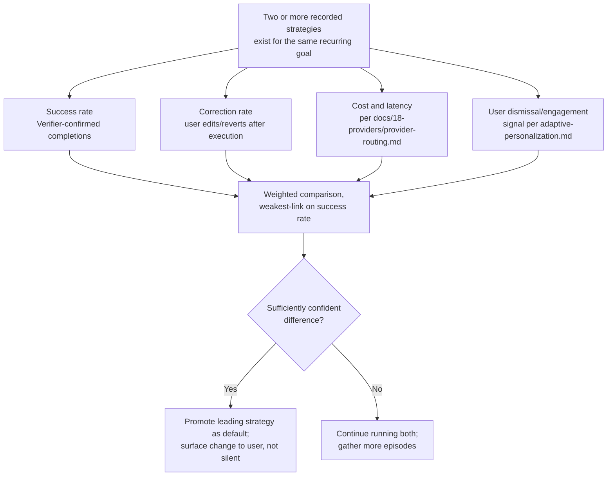

# Strategy Evaluation

## Purpose

Specifies how NOVA compares multiple ways of accomplishing a **recurring**
goal against each other over time and promotes the better-performing one
— the concrete mechanism behind "NOVA should become better every day" for
multi-step workflows specifically. This is distinct from two existing,
narrower capabilities it builds on:

- `docs/05-ai/episodic-replay.md` reuses the single most similar prior
  successful plan for a new instance of a similar task — it does not
  compare two competing approaches against each other, and it has no
  mechanism for concluding one recorded approach is reliably worse than
  another and should stop being offered.
- `docs/23-autonomy/adaptive-personalization.md` adapts single-parameter
  defaults (tone, routing, timing) from feedback — it does not evaluate
  or retire a multi-step Composite Tool or Workflow
  (`docs/17-workflow/workflow-engine.md`).

## Scope

Comparison, promotion, and retirement of alternative strategies for the
same recurring goal. It does not introduce a new execution mechanism —
every strategy compared here is an ordinary recorded episode
(`episodic-replay.md`) or Composite Tool
(`docs/23-autonomy/self-growing-capability.md`); this document is the
evaluation layer above them.

## When a "strategy comparison" exists at all

A recurring goal accumulates multiple *candidate* strategies only when
NOVA has, across separate occasions, executed genuinely different
approaches to it — for example, two different Composite Tools
independently created for "summarize my inbox every Monday," or a
Workflow that was manually edited by the user partway through its
history, creating a before/after split. A goal with only ever one
recorded approach has nothing to compare and is untouched by this
document — this capability activates on divergence, not by default.

## Comparison signals

- **Success rate** — the proportion of recorded runs the Verifier
  (`docs/03-runtime/verifier.md`) confirmed as fully successful,
  weighted more heavily than any other signal, since a faster or
  cheaper strategy that fails more often is not actually better.
- **Correction rate** — how often the user edited or reverted the
  strategy's output afterward, the same signal
  `adaptive-personalization.md` already uses for tone/defaults, applied
  here at the strategy level.
- **Cost and latency** — from the existing provider usage log
  (`docs/18-providers/provider-routing.md`'s observability log), used
  only as a tie-breaker between strategies of statistically
  indistinguishable success rate, never to promote a cheaper-but-worse
  strategy.
- **Explicit dismissal/engagement** — where the strategy produces a
  proactive suggestion (`background-life-assistant.md`), the same
  dismiss/engage feedback `adaptive-personalization.md` already reads.

## Promotion is never silent

A promotion — making one strategy the default the Planner reaches for via
`episodic-replay.md`'s retrieval — is surfaced to the user as a visible
change ("your Monday inbox summary now uses the shorter format, since
you've edited the longer one every time for the past month"), with an
option to revert to the previous default or pin a specific strategy
permanently, exactly as `adaptive-personalization.md` already requires
for any adaptive change. Promotion is never a purely internal ranking
change the user cannot see or undo.

## Retirement

A strategy is retired — no longer offered as a candidate by
`episodic-replay.md`'s retrieval — only when a clearly better alternative
has been promoted **and** the retired strategy has not been the user's
explicit choice in its most recent occurrences. Retirement never deletes
the underlying recorded episode or Composite Tool
(`docs/06-tools/tool-registry.md`); it is removed from active
consideration, not from history, and remains inspectable and
re-activatable from Settings like any other saved automation
(`self-growing-capability.md`'s "editable and removable" guarantee).

## Boundaries

- **Comparison requires multiple actually-recorded strategies** — this
  document never generates a second strategy purely to have something to
  compare against; strategies arise from genuine execution history or
  explicit user edits only.
- **No model weight changes.** Comparison and promotion operate entirely
  over structured outcome records (success/correction/cost), exactly as
  `adaptive-personalization.md`'s equivalent boundary states for its own
  scope.
- **Never applies at the destructive/irreversible risk tier without the
  normal confirmation gate** — a "better" strategy for a high-risk action
  is still confirmed on each use per `docs/10-security/permissions.md`;
  strategy promotion changes which plan is *proposed*, never which plans
  bypass confirmation.

## Related documents

- `docs/25-failure-modes/FM-18-autonomy-policy-approval.md` — failure modes for this subsystem
- `docs/05-ai/episodic-replay.md` — the retrieval mechanism strategies
  are promoted into or retired out of
- `docs/23-autonomy/self-growing-capability.md` — where Composite Tool
  strategies originate
- `docs/23-autonomy/adaptive-personalization.md` — the single-parameter
  adaptation model this extends to multi-step strategies, and the
  visibility/revert guarantee this document reuses unchanged
- `docs/03-runtime/verifier.md` — the success-rate data source
- `docs/17-workflow/workflow-engine.md` — Workflow-graph strategies, a
  strategy type alongside Composite Tools
