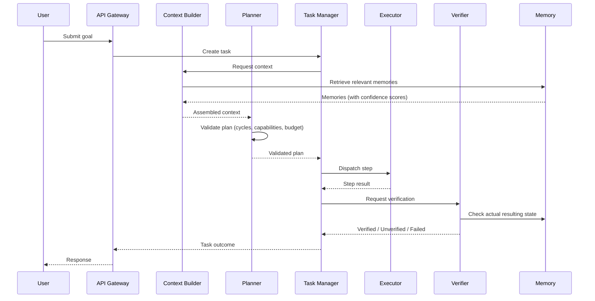
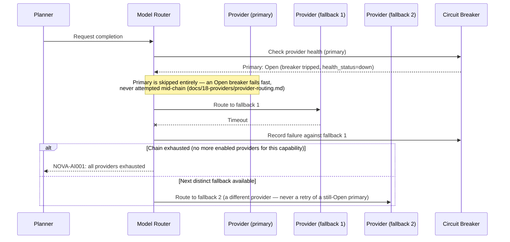
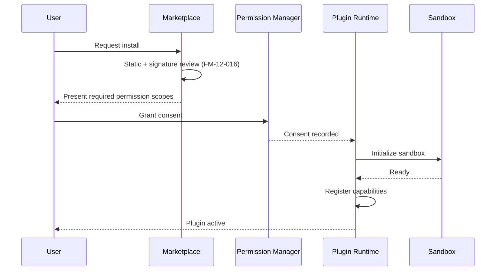
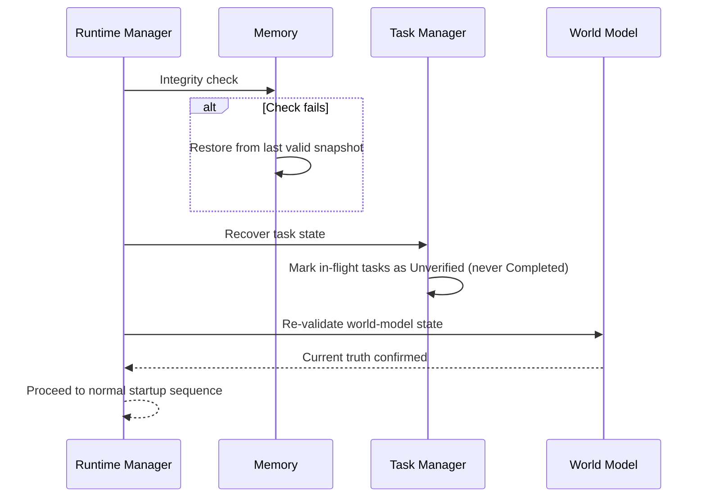

# Sequence Diagrams for Critical Flows

## Purpose

Mermaid sequence diagrams for the flows most worth seeing as an
interaction over time rather than as a static table or tree — useful
alongside `01-component-dependency-graph.md` (structure) and
`04-state-transition-tables.md` (per-entity state) to see how components
actually talk to each other during the flows most likely to go wrong.

## Flow 1: User request → Plan → Execute → Verify

Note the mandatory `Verifying` hop before any outcome reaches the user —
this diagram is the sequence-level view of the invariant stated in
`04-state-transition-tables.md`'s Task Lifecycle table and enforced against
`FM-05-016` (false success reporting).

## Flow 2: Provider fallback chain

The primary only becomes eligible again on a **later, separate**
request, once its own 60-second cooldown elapses and its breaker moves
to `HalfOpen` (`docs/26-system-reference/
19-ordering-concurrency-and-retry-rules.md`) — that transition is
timer-driven, not something this request's fallback walk triggers or
waits for.

See `docs/25-failure-modes/FM-04-model-router-provider-fallback.md` for
the full failure catalog this diagram's branches map to.

## Flow 3: Plugin install and sandbox activation

This diagram's steps span the `Installed` → `Enabled` transition in
`docs/16-extensibility/plugin-lifecycle.md`'s canonical state machine —
review and consent happen while still `Installed` (package present,
tools not yet registered); the sandbox-init and capability-registration
steps are exactly what moving to `Enabled` means. A plugin that reaches
"Plugin active" without traversing every step above has skipped a
required lifecycle gate, not taken a shortcut.

## Flow 4: Crash recovery on startup

## Related documents

- `docs/02-architecture/lifecycle.md` — full prose detail behind Flow 4
- `docs/03-runtime/failure-recovery.md` — general recovery mechanics
  underlying Flow 2's fallback branching
- `docs/16-extensibility/plugin-lifecycle.md` — full detail behind Flow 3
- `04-state-transition-tables.md` (this folder) — per-entity states these
  flows transition through

## Where This Breaks

This document is itself a build artifact an AI agent relies on. If it drifts from the real system, every agent that trusts it inherits the drift silently. The failures below are specific to *this document going stale or being wrong*, not to the subsystem it describes (see the cross-referenced FM files for that).

| ID | Failure | Trigger | Detection | Severity | Mitigation | Recovery |
|---|---|---|---|---|---|---|
| **FM-24-033** | Diagram omits an error branch present in real behavior | A sequence diagram shows only the happy path, and an agent implements accordingly, missing a real failure branch. | Implementation review compares actual error-handling code against the diagram's `alt`/`opt` branches. | Medium | Every sequence diagram in this file must include at least one `alt` failure branch for any step that can fail, not just the happy path — as done above for Flows 2 and 4. | Add the missing branch to the diagram; audit the implementation for the corresponding missing error handling. |
| **FM-24-034** | Diagram drifts from the actual message flow after a refactor | Component interaction changes in code (e.g. a new intermediary service inserted) without the diagram being updated. | No automated check catches this reliably for sequence diagrams specifically (unlike the more structured checks in `11-documentation-lint-ci.md`) — relies on review discipline. | Medium | Flag sequence-diagram updates explicitly in the PR template for any change touching the participants shown in a given diagram. | Update the diagram in the same PR; if drift is found later, correct it and note the correction in the file's own edit history. |
| **FM-24-035** | Reader treats a diagram as normative over the prose documents it summarizes | Sequence diagrams are illustrative; the authoritative behavior contract is always the prose document(s) linked in Related documents. | An implementation follows the diagram exactly even where a linked prose document specifies additional required behavior (e.g. specific timeout values) the diagram omits for readability. | Low | State explicitly (as this file does) that diagrams are illustrative and link to authoritative prose for full contract detail. | Correct the implementation against the authoritative prose document; treat the diagram as needing enrichment if the missing detail was genuinely important to visualize. |
