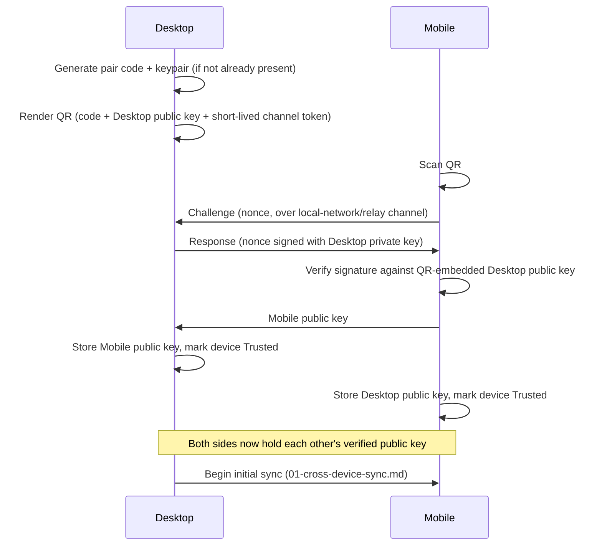

# Device Pairing Protocol

## Purpose

The exact step-by-step protocol for establishing trust between two
devices (typically Desktop ↔ Mobile, but the same protocol applies to
Desktop ↔ Desktop for a new Full Peer), expanding
`docs/20-devices/multi-device-architecture.md`'s summary into a
sequence an implementer can build directly from.

## Sequence

```
Desktop (initiating device)
      ↓
Generate Pair Code
      ↓
Render as QR
      ↓
Mobile scans QR
      ↓
Mobile sends Challenge
      ↓
Desktop sends Response (signed with Desktop's private key)
      ↓
Keys exchanged (both public keys now known to both sides)
      ↓
Device marked Trusted
      ↓
Ready (registered per 01-cross-device-sync.md, initial sync begins)
```



## Properties this protocol guarantees

- **Never over the open internet unauthenticated** — the channel used
  for the QR/challenge/response exchange is short-lived and either local
  network or a relay the user has already authenticated to, per
  `docs/20-devices/multi-device-architecture.md`.
- **Mutual verification** — the challenge/response step proves the
  Desktop possesses the private key matching the QR-embedded public key;
  simply scanning a QR code is not sufficient to establish trust.
- **No permanent silent auto-trust** — pairing is always a
  user-in-the-loop action (scanning a QR, confirming a code) on at least
  one side, distinct from the "trust this device for N hours" temporary
  grant available in `docs/20-devices/remote-control.md` for an
  *already-paired* device's live session.
- **Pair codes are single-use and time-boxed** — a generated code expires
  after a short window and cannot be reused for a second pairing attempt,
  closing the replay window described in Where This Breaks below.

## Storage

The resulting pairing keypair is stored per
`docs/18-providers/credential-management.md` (OS credential vault, not a
plain config file) and used to authenticate all subsequent sync
(`01-cross-device-sync.md`) and remote-control (`docs/20-devices/remote-control.md`) traffic between the two devices.

## Related documents

- `docs/20-devices/multi-device-architecture.md` — topology this
  protocol establishes trust for
- `docs/18-providers/credential-management.md` — key storage
- `docs/20-devices/remote-control.md` — the live-session layer built on
  top of an already-paired trust relationship

## Where This Breaks

Failure modes specific to this protocol area. Cross-referenced from `docs/25-failure-modes/FM-26-multi-device-protocol.md`, which indexes all multi-device failure entries in one place, and from `FM-10-desktop-android-distributed-sync.md` for the general distributed-systems failure classes this protocol area instantiates.

| ID | Failure | Trigger | Detection | Severity | Mitigation | Recovery |
|---|---|---|---|---|---|---|
| **FM-26-005** | Pair code intercepted and reused before the legitimate device completes pairing | An attacker with brief physical/network proximity captures the QR code or code string during the time-box window. | Two devices attempt to complete the challenge/response for the same pair code near-simultaneously. | Critical | Single-use enforcement: the first successful challenge/response for a given code invalidates it immediately for any other attempt, and codes expire quickly (short time-box). | Invalidate the pairing immediately upon detecting a double-use attempt; alert the user on the initiating device; require a fresh pairing attempt. |
| **FM-26-006** | Challenge/response step is skipped by an implementation shortcut, trusting the QR content alone | Under time pressure, an implementation treats 'QR scanned successfully' as equivalent to 'trust established,' skipping the signature verification step. | Security review / penetration test finds pairing succeeds without a valid signed response. | Critical | Treat the challenge/response step as a hard, non-optional requirement in the protocol spec (as stated above) and cover it with a dedicated conformance test, not just an integration happy-path test. | Patch the implementation immediately; treat any device paired via the shortcut as untrusted and require re-pairing through the correct flow. |
| **FM-26-007** | Pairing succeeds but the two devices disagree about which runtime mode (Full Peer vs. Companion) the new device is in | Mode selection UI/logic bug assigns the wrong mode, or the two devices' local records of the agreed mode diverge. | `01-cross-device-sync.md`'s sync-priority logic or `distributed-task-scheduling.md`'s peer-assignment logic behaves inconsistently with what the user configured. | Medium | Make runtime mode part of the signed pairing exchange itself (not a separate, unsynchronized post-pairing setting) so both sides agree on it from the same source of truth. | Re-confirm and re-set the mode explicitly on both devices; treat a mode mismatch as equivalent to a config-drift class failure (`docs/25-failure-modes/FM-15-004`). |
