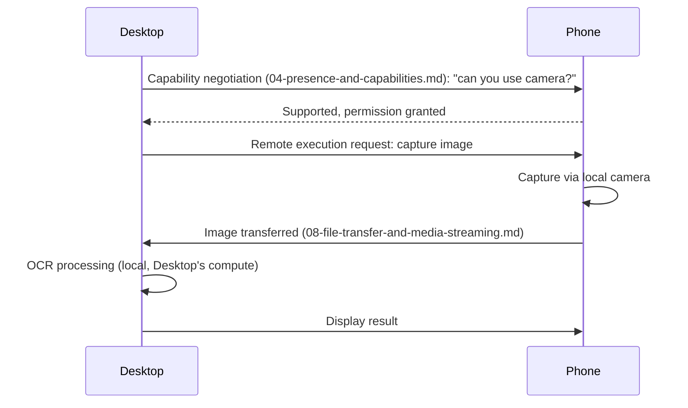

# Session Continuity, Handoff & Remote Execution

## Purpose

Covers the user-facing "walk away from the desktop, pick up the phone,
continue instantly" experience, the underlying handoff mechanics between
devices, and remote execution (one device performing an action on
another device's behalf).

## Session continuity rules

| Element | Continuity rule |
|---|---|
| Cursor / active turn | Whichever device sends the next message becomes the active device for that turn; no device needs to explicitly "release" the session |
| Voice | An in-progress voice interaction on Device A can be picked up as text on Device B mid-conversation, but does not itself transfer live audio — Device B starts from the last committed turn, not a live audio stream (see `08-file-transfer-and-media-streaming.md` for live media handoff specifically) |
| Workflow | A running workflow's state is visible from any device (`01-cross-device-sync.md`'s in-flight-task-state sync) but continues *executing* on whichever device originally started it, unless explicitly reassigned via `distributed-task-scheduling.md` |
| Drafts | Unsent draft messages sync as a distinct, lower-priority category (per `01-cross-device-sync.md`'s priority order) — a draft started on one device is visible, though possibly slightly stale, on another |
| Open tabs / browser context | Synced as reference metadata (URL, title) for continuity; the actual browser session itself is not transferred, per the browser-as-surface note in `docs/20-devices/multi-device-architecture.md` |
| Running agents | An in-flight multi-agent task (`docs/24-collaboration/multi-agent-collaboration.md`) is visible from any device but the agents themselves keep executing wherever they started — "continuing" from another device means observing/steering, not literally relocating agent execution |

## Handoff

```
Desktop starts voice conversation
      ↓
Phone continues (session state already synced per session-continuity rules above)
      ↓
Desktop closes
      ↓
Nothing breaks — Phone was never dependent on Desktop staying open
```

The critical rule: **handoff is not a live transfer of execution state**
for anything beyond what's already captured in synced session/task
state. A device closing does not need to "hand off" anything at the
moment of closing, because continuity was already achieved continuously
via ordinary sync, not via a special handoff event triggered at
close-time. This avoids the entire class of failure where a handoff
event itself fails and continuity breaks — there is no single point of
handoff to fail.

## Remote execution

Example: Desktop needs the phone's camera for OCR.



**Who executes what** is always explicit and negotiated per-step, never
assumed: the device with the required hardware capability
(`04-presence-and-capabilities.md`) executes the capability-specific
step; a device with more compute (typically Desktop/Primary Runtime)
executes compute-heavy steps like OCR/inference, per the general
task-assignment rule in `docs/20-devices/distributed-task-scheduling.md`.

## Related documents

- `docs/20-devices/cross-device-memory.md` — the sync layer session
  continuity is built on
- `04-presence-and-capabilities.md` — capability negotiation detail
- `docs/20-devices/distributed-task-scheduling.md` — full task-assignment rules
- `08-file-transfer-and-media-streaming.md` — how the actual bytes (image,
  audio) move in a remote-execution flow

## Where This Breaks

Failure modes specific to this protocol area. Cross-referenced from `docs/25-failure-modes/FM-26-multi-device-protocol.md`, which indexes all multi-device failure entries in one place, and from `FM-10-desktop-android-distributed-sync.md` for the general distributed-systems failure classes this protocol area instantiates.

| ID | Failure | Trigger | Detection | Severity | Mitigation | Recovery |
|---|---|---|---|---|---|---|
| **FM-26-008** | Continuation on a second device shows stale state because sync hadn't completed before the user switched | User expects instant continuity but the last few seconds of activity on Device A haven't synced to Device B yet. | User reports missing recent context after switching devices. | Medium | Prioritize sync for the active session's own state above ordinary background sync priority the moment a session goes idle on one device (an anticipatory sync, not just periodic). | Force an immediate sync-on-demand when a device becomes active after being idle, rather than waiting for the next periodic sync cycle. |
| **FM-26-009** | Remote execution request sent to a device that silently lost the capability since negotiation | Phone's camera permission was revoked between capability negotiation and the actual execution request (race condition, same shape as `docs/25-failure-modes/FM-04-016`). | Execution request fails with a permission error despite capability negotiation having succeeded moments earlier. | Medium | Re-verify capability/permission immediately before executing, not only at negotiation time — same principle as `FM-04-016`'s re-validation mitigation. | Fall back to renegotiating capability, or surface the specific lost-capability reason to the user rather than a generic failure. |
| **FM-26-010** | Two devices both believe they are the 'active' device and both attempt to continue the same workflow | Handoff's no-single-point-of-failure design (described above) has an edge case: both devices come online simultaneously after being offline and each assumes it should resume. | Duplicate execution detected for the same task ID across two devices (`docs/25-failure-modes/FM-10-019`). | Medium | Apply the same distributed-lock/single-coordinator assignment from `FM-10-019` to workflow resumption specifically, not just fresh task dispatch. | Keep the first-completed result, roll back the duplicate via compensation, per `FM-10-019`'s recovery. |
