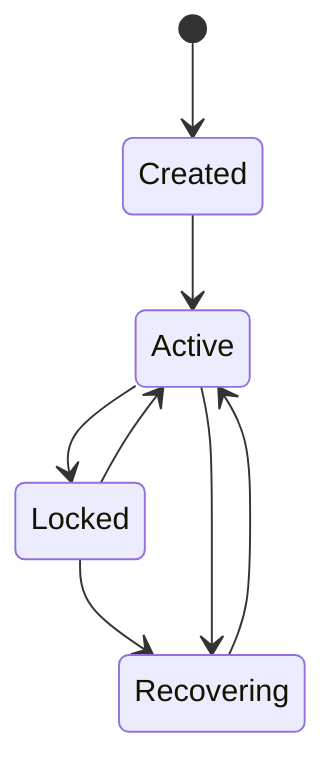

# Identity & Workspace

## Identity hierarchy

```
User
 └── Workspace
      └── Device (Full Peer or Companion, per multi-device-architecture.md)
           └── Session
                └── Agent (a sub-agent instance within a task, per
                    docs/24-collaboration/multi-agent-collaboration.md)
Plugin (cross-cutting — scoped to a Device, but its identity/permissions
        are tracked independently of the Session/Agent hierarchy above)
```

- **User** — a single NOVA identity, per `docs/20-devices/multi-device-architecture.md`'s "one identity spans all paired devices" rule. NOVA
  remains explicitly not multi-user (`docs/00-overview/non-goals.md`).
- **Workspace** — see below; the top-level container for a user's
  memory/knowledge-graph/config, distinct from any one device.
- **Device** — a registered, paired device (`02-device-pairing-protocol.md`), operating as Full Peer or Companion.
- **Session** — a bounded conversation/interaction window on a specific
  device, per `docs/26-system-reference/04-state-transition-tables.md`'s
  Session state machine.
- **Agent** — an individual sub-agent instance within a task, scoped to
  that task's lifetime, per `docs/24-collaboration/multi-agent-collaboration.md`.
- **Plugin** — scoped to the device it's installed on
  (`09-config-secrets-plugin-distribution.md`), with its own permission
  identity independent of any session/agent.

## Workspace

A **Workspace** is the top-level container: one workspace per user (per
the identity hierarchy above), holding the full memory/knowledge-graph/
config that syncs across every paired device. "Multiple workspaces" is
not currently a supported concept — a second workspace would imply a
second, independent identity, which is explicitly out of scope per the
non-goals referenced above.

| Operation | Rule |
|---|---|
| Sync | See `01-cross-device-sync.md` in full — this is what workspace sync *is* |
| Share | Not supported between different Users (would violate the
  single-user-identity non-goal); *within* one user's own paired devices,
  sharing is simply the normal sync behavior, not a distinct "share" action |
| Lock | A workspace-level lock is only used for specific consistency-
  critical operations (e.g. mid-`nova upgrade`'s schema migration,
  `docs/27-cli/02-bootstrap-and-health.md`) — never as an ordinary
  operating mode, since a locked workspace blocks all devices' sync |
| Recover | Per `docs/26-system-reference/05-data-ownership.md`'s
  cross-reference to `docs/25-failure-modes/FM-21-catastrophic-failures.md` — workspace recovery follows the same backup/restore
  procedure as single-device Memory recovery, since a workspace's
  durable state has one logical source of truth (whichever device's
  backup is most recent and valid) even though it's replicated across
  many devices |
| Merge | Only relevant in the split-brain recovery case
  (`docs/25-failure-modes/FM-10-017`) — two divergent workspace
  histories are merged using the same memory-lineage conflict rules as
  ordinary sync, not a special one-off merge algorithm |

## Workspace state machine

The table above describes workspace *operations*; this section names the
states those operations move between, since two other documents in this
repository had each independently invented a different, unverifiable
lifecycle for Workspace in the absence of one being specified here.
Grounded strictly in the behavior already described above — no new
capability is introduced by naming these states.



- **Created** — workspace initialized for a new user identity; no sync
  history yet.
- **Active** — normal operating state: syncing across paired devices per
  the Sync row above.
- **Locked** — a workspace-level lock is held for a specific
  consistency-critical operation (the Lock row above); all devices'
  sync blocks until the lock is released. Must have a bounded lease
  with automatic expiry (`FM-26-029`) — never an indefinite hold.
- **Recovering** — integrity check / backup-restore in progress, entered
  either from a `Locked` state whose lease expired without a clean
  release (`FM-26-029`) or from `Active` when split-brain merge
  (`FM-10-017`) or catastrophic recovery (`FM-21-catastrophic-failures.md`) is triggered; returns to `Active` once consistency is verified.

There is no terminal/archived state: a workspace exists for the
lifetime of its user identity, consistent with "one workspace per user"
above and with no account-deletion behavior currently specified anywhere
in this repository. If account deletion is specified in a future
revision, a terminal state must be added here first, in this canonical
document, before any other document may reference it.

## Related documents

- `docs/20-devices/multi-device-architecture.md` — identity-spans-
  devices rule this hierarchy implements
- `docs/00-overview/non-goals.md` — the single-user-identity boundary
- `docs/24-collaboration/multi-agent-collaboration.md` — the Agent level
  of this hierarchy in full detail
- `docs/25-failure-modes/FM-21-catastrophic-failures.md` — workspace-
  level recovery procedures

## Where This Breaks

Failure modes specific to this protocol area. Cross-referenced from `docs/25-failure-modes/FM-26-multi-device-protocol.md`, which indexes all multi-device failure entries in one place, and from `FM-10-desktop-android-distributed-sync.md` for the general distributed-systems failure classes this protocol area instantiates.

| ID | Failure | Trigger | Detection | Severity | Mitigation | Recovery |
|---|---|---|---|---|---|---|
| **FM-26-029** | Workspace lock held during migration is never released due to a crash mid-upgrade | `nova upgrade` (`docs/27-cli/02-bootstrap-and-health.md`) crashes after acquiring the lock but before its transactional rollback/completion logic runs. | All devices' sync attempts fail/block indefinitely against a held lock with no owner still alive. | High | Locks used for workspace-level operations must have a bounded lease with automatic expiry, not an indefinite hold, so a crashed lock-holder doesn't permanently block the workspace. | Force-release the expired lock; verify workspace consistency (integrity check, same as `docs/26-system-reference/02-startup-sequence.md`'s crash-recovery step) before allowing normal sync to resume. |
| **FM-26-030** | Identity hierarchy is misapplied to justify a feature that would effectively create multi-user support | A feature request (e.g. 'let me share my workspace read-only with a family member') is implemented by loosening the Share rule above, silently reintroducing multi-tenancy the non-goals explicitly excluded. | Design review against `docs/00-overview/non-goals.md` catches the scope creep before implementation. | Medium | Any feature touching the Share row of this table must be checked against the non-goals document and requires a new ADR to change, per that document's own stated amendment process. | Revert the scope-creeping implementation; if the underlying need is legitimate, route it through a proper ADR rather than an incremental feature that quietly crosses the boundary. |
