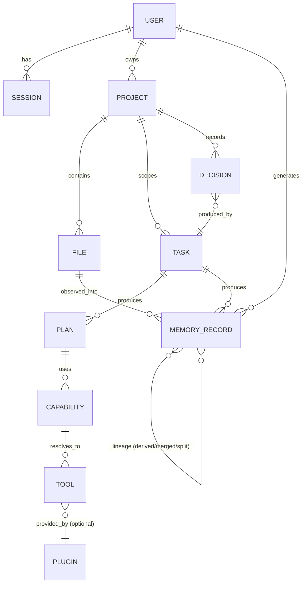

# Diagram: Entity Relationships

## Purpose

One logical entity-relationship diagram spanning every major entity type
across this repository — Users, Projects, Files, Tasks, Capabilities,
Agents, Plugins, Memory records, Sessions, and Plans — as a single
onboarding reference. This is a logical model, not a physical database
schema; concrete storage per entity type is
`docs/04-memory/memory-storage.md`.

## Source

Synthesized from `docs/04-memory/ontology.md` (Knowledge Graph entities),
`docs/03-runtime/task-manager.md` (Task), `docs/05-ai/capability-registry.md` (Capability), `docs/16-extensibility/plugin-architecture.md` (Plugin), and `docs/10-security/authentication.md`
(User, Session). Each entity's authoritative field-level schema lives in
its owning document; this diagram shows relationships only.

## Diagram

## Reading notes

- **PROJECT to FILE/TASK/DECISION** mirrors the Knowledge Graph's
  `belongs_to` and `produced_by` edges exactly (`docs/04-memory/ontology.md`) — this diagram is a relationship-level restatement, not
  an independent model.
- **PLAN to CAPABILITY to TOOL** shows the resolution chain from
  `docs/05-ai/capability-registry.md`: a plan references capabilities,
  never tools directly.
- **TOOL to PLUGIN** is optional (`}o--||`) since not every tool
  originates from a plugin — native, MCP, API, and CLI tools
  (`docs/06-tools/`) exist independent of the plugin system.
- **MEMORY_RECORD to MEMORY_RECORD** (self-referential) represents
  lineage relationships (`docs/04-memory/memory-lineage.md`) —
  `derived_from`, `summarized_from`, `merged_from`, `split_from`.

## What this diagram deliberately omits

Individual field-level attributes (already documented per entity in its
owning schema) and the full Knowledge Graph ontology's complete node/edge
type list (`docs/04-memory/ontology.md` is authoritative for that) — this
diagram is intentionally a relationship-level map for orientation, not a
substitute for the detailed schemas it references.

## Related documents

- `docs/references/schema-index.md` — the field-level schema index this
  diagram complements
- `docs/04-memory/ontology.md` — the authoritative Knowledge Graph
  node/edge schema
- `docs/05-ai/capability-registry.md`, `docs/16-extensibility/plugin-architecture.md` — the Capability and Plugin schemas referenced
  above
