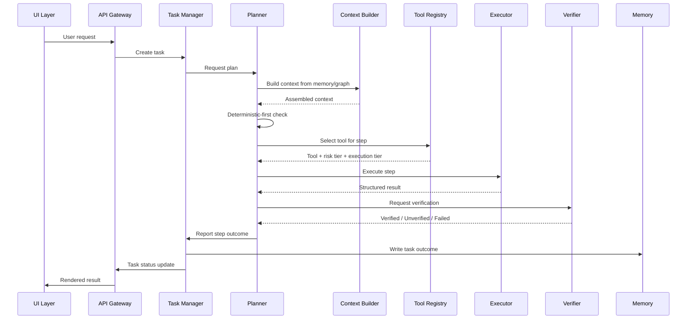
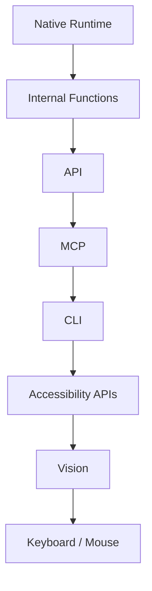

# Diagram: Execution Pipeline

## Purpose

Standalone reference to the request-to-verified-result pipeline and the
execution-priority chain.

## Source

Authoritative in `docs/02-architecture/execution-pipeline.md` and `docs/06-tools/execution-priority.md`.

## Request-to-result sequence

## Execution priority chain

## Reading notes

In the sequence diagram, the Permission Manager gate (not shown as a
separate participant here for visual simplicity) sits between Tool
Registry's response and Executor's invocation for every step, per
`docs/03-runtime/permission-manager.md` — it is omitted from this
diagram only for readability, not because it is optional; see
`docs/02-architecture/execution-pipeline.md` for the complete,
gate-inclusive description.

## Related documents

- `docs/02-architecture/execution-pipeline.md`,
  `docs/06-tools/execution-priority.md` — the full specifications these
  diagrams illustrate
- `docs/03-runtime/permission-manager.md` — the gate omitted here for
  visual simplicity
