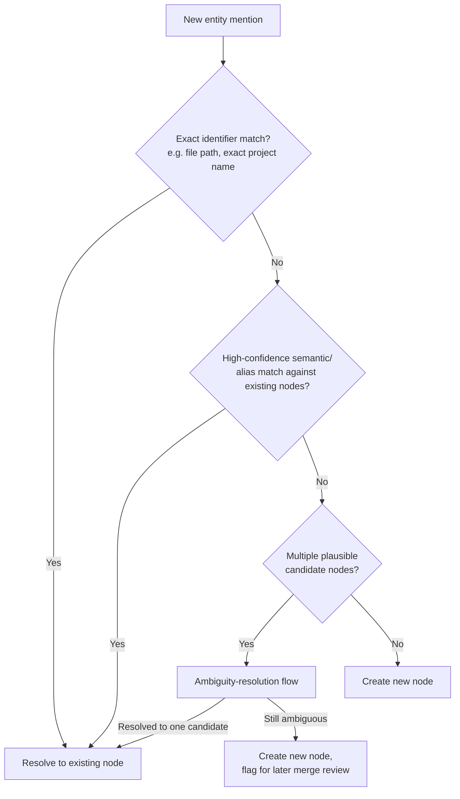

# Diagram: Knowledge Graph

## Purpose

Standalone reference to the Knowledge Graph's entity resolution flow,
complementing the tier diagram in `memory.md`.

## Source

Authoritative in `docs/04-memory/entity-resolution.md`.

## Entity resolution diagram

## Node and edge type reference

See `docs/04-memory/ontology.md` for the full, current table of node
types (User, Project, File, Application, Task, Decision, Tool,
Conversation) and edge types (`belongs_to`, `depends_on`, `produced_by`,
`performed_on`, `related_to`) — reproduced there as the authoritative,
versioned schema rather than duplicated here, since this diagrams folder
intentionally does not restate content that changes with ontology
versioning.

## Reading notes

The "flag for later merge review" path is what prevents a low-confidence
match from being silently and incorrectly merged into an existing node —
per `docs/04-memory/entity-resolution.md`, false merges are considered
harder to detect and correct than duplicates, which is why this path
creates a new node rather than forcing a resolution.

## Related documents

- `docs/04-memory/entity-resolution.md`, `ontology.md` — the full
  specifications this diagram illustrates
- `memory.md` (this folder) — the tier structure this graph is populated
  from
