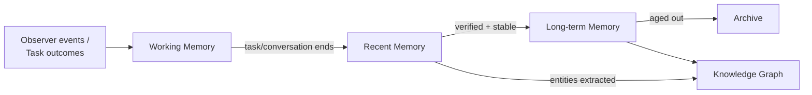
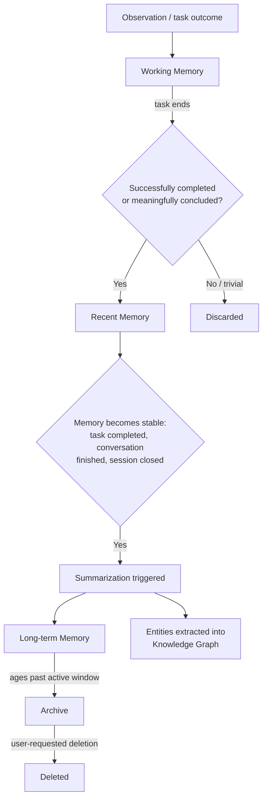

# Diagram: Memory Architecture

## Purpose

Standalone reference to the four-tier memory flow and lifecycle
diagrams.

## Source

Authoritative in `docs/04-memory/memory-architecture.md` and `memory-lifecycle.md`.

## Tier flow diagram

## Lifecycle diagram

## Reading notes

The two diagrams are complementary, not redundant: the tier flow diagram
shows structural relationships between tiers; the lifecycle diagram shows
the triggers and conditions governing movement between them. Note that
"Discarded" (top diagram) applies only to trivial, non-meaningful Working
Memory content — it is distinct from the user-controlled deletion path
reachable only from Archive, per `docs/04-memory/memory-lifecycle.md`.

## Related documents

- `docs/04-memory/memory-architecture.md`, `memory-lifecycle.md` — the
  full specifications these diagrams illustrate
- `knowledge-graph.md` (this folder) — the graph these tiers feed
