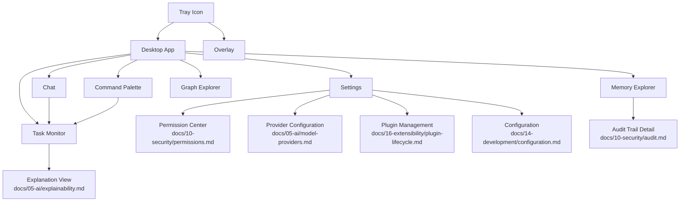

# Diagram: UI Navigation Map

## Purpose

A sitemap-style view of every UI surface, screen, and settings page and
how a user moves between them — complementing `docs/diagrams/ui.md`'s
surface-to-backend relationship diagram with the user-facing navigation
structure specifically.

## Source

Synthesized from `docs/09-ui/ui-overview.md` and each individual surface
document in that folder.

## Diagram

## Reading notes

The Permission Center, Provider Configuration, Plugin Management, and
Configuration screens are all reachable from a single Settings entry
point in the Desktop app, consistent with
`docs/10-security/permissions.md`'s requirement that permission
management not be scattered — this diagram makes that single-entry-point
requirement visually explicit. Task Monitor is reachable from every
task-initiating surface (Chat, Command Palette), not only the Desktop
app directly, per `docs/09-ui/ui-overview.md`'s shared-backend
principle. The Explanation View is reached from Task Monitor specifically
because an explanation (`docs/05-ai/explainability.md`) is most useful
in the context of a specific task's progress or history.

## What this diagram does not cover

Visual layout, component-level design (buttons, cards, panels) — a full
component library is deliberately not specified in this architecture
repository; it belongs to implementation-time design work (informed by
`docs/09-ui/design-system.md`'s tokens), produced alongside actual UI
construction rather than invented speculatively here without a concrete
screen to validate it against.

## Related documents

- `docs/diagrams/ui.md` — the surface-to-backend relationship diagram
  this map complements
- `docs/09-ui/ui-overview.md` — the full surface index
- `docs/09-ui/design-system.md` — visual tokens, as distinct from this
  diagram's navigation-structure focus
