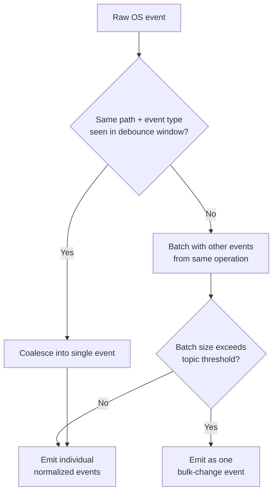

# Diagram: Observer Framework

## Purpose

Standalone reference to the event-storm handling flow, the most visually
complex diagram in the observer framework's specification.

## Source

Authoritative in `docs/02-architecture/event-driven-architecture.md`.

## Event storm handling

## Observer source summary

See `docs/07-observers/observer-framework.md` for the full, current table
of observer sources, what each captures, and what each explicitly does
not capture — reproduced there rather than duplicated here since that
table is maintained alongside the observer implementations it describes.

## Reading notes

This diagram is specifically the mitigation for the event-storm scenario
identified during this project's foundational review (a large git clone
producing tens of thousands of raw filesystem events) — the "bulk-change
event" output path is what prevents that scenario from overwhelming
downstream Memory and Knowledge Graph consumers, per
`docs/04-memory/indexing.md`'s dedicated bulk-ingestion handling.

## Related documents

- `docs/02-architecture/event-driven-architecture.md` — the full
  specification this diagram illustrates
- `docs/07-observers/observer-framework.md` — the source index this
  diagram's inputs originate from
