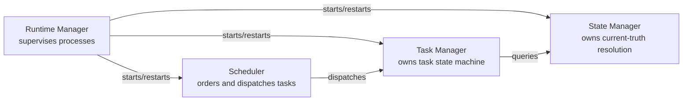
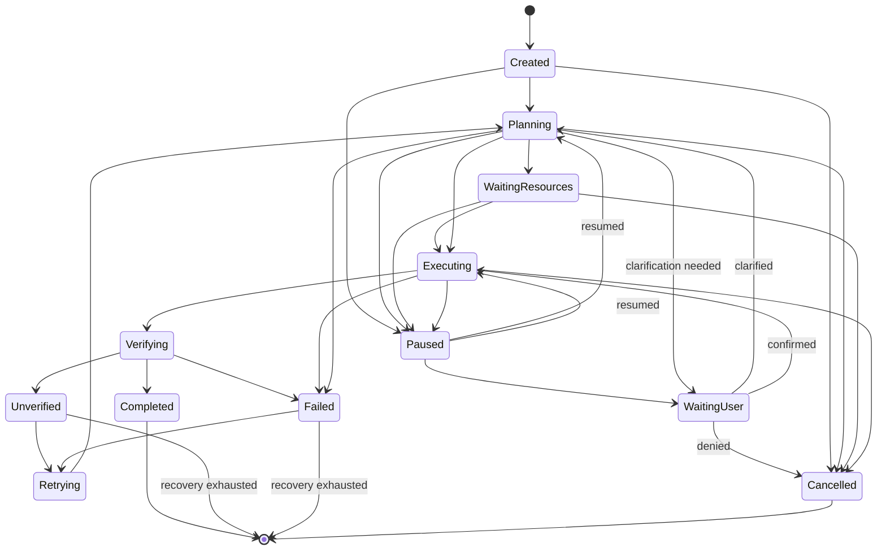

# Diagram: Runtime Services

## Purpose

Standalone reference to the runtime-service relationship diagram
distinguishing Runtime Manager, Scheduler, Task Manager, and State
Manager.

## Source

Authoritative in `docs/02-architecture/runtime-architecture.md`.

## Diagram

## Task state machine (companion diagram)

## Reading notes

`Unverified` is drawn as a distinct state reachable only from `Verifying` and never merged visually with `Failed` or `Completed`, reflecting its
status as a first-class, non-success outcome per
`docs/01-product/success-metrics.md`. `WaitingUser` is drawn with two
entry points — through `Paused` (a pending Permission Manager
confirmation) and directly from `Planning` (a pending ambiguity-
resolution clarifying question, `docs/05-ai/ambiguity-resolution.md`) —
distinguishing both from a general pause, since either requires a
specific user action to unblock, not a plain resume. `Retrying` is a distinct, visible state
rather than an invisible internal loop, so retry count and history remain
directly inspectable. See `docs/03-runtime/task-manager.md` for the full
state definitions, including why `Archived` is deliberately not shown
here as a peer state — it is a separate, memory-lifecycle-driven
progression applied to any terminal task's record over time.

## Related documents

- `docs/02-architecture/runtime-architecture.md` — the narrative this
  diagram illustrates
- `docs/03-runtime/task-manager.md` — the full state machine
  specification
