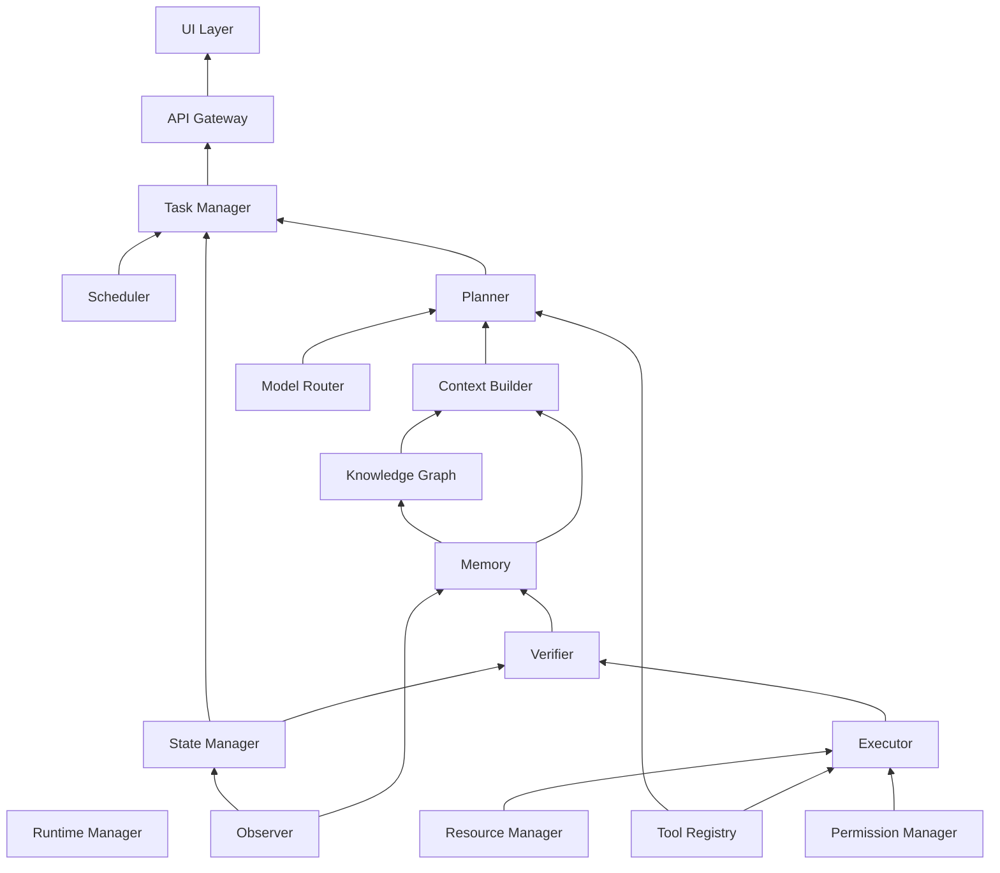

# Diagram: Service Dependency Map

## Purpose

Standalone reference to the full service dependency graph governing
startup order and failure-domain reasoning.

## Source

Authoritative in `docs/02-architecture/dependency-map.md`.

## Dependency graph

## Reading notes

Arrows point toward the dependency (e.g., Planner depends on Context
Builder, Model Router, and Tool Registry). This graph is a topological
sort input for `docs/02-architecture/lifecycle.md`'s startup sequence and
a failure-isolation reference for `docs/02-architecture/service-architecture.md` — a service failure only necessarily degrades
services that depend on it downstream in this graph, not services
upstream of or unrelated to it.

## Related documents

- `docs/02-architecture/dependency-map.md` — the full specification this
  diagram illustrates, including the no-cycles rule
- `docs/02-architecture/lifecycle.md` — the startup sequence derived from
  this graph
