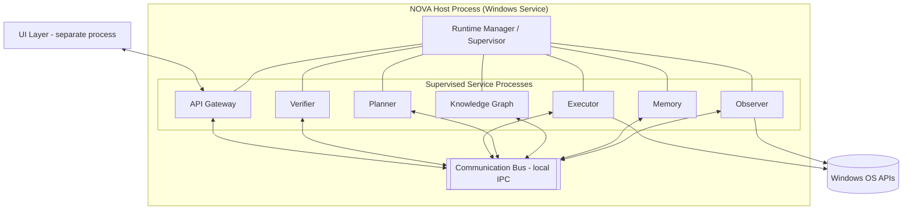

# Diagram: System Overview

## Purpose

Standalone reference to NOVA's top-level system diagram, for readers who
want the visual without navigating into the full architecture narrative.

## Source

This diagram is authoritative in, and must be kept in sync with,
`docs/02-architecture/system-architecture.md`.

## Diagram

## Reading notes

The UI Layer's isolation from the Communication Bus (connecting only
through the API Gateway) is the visual representation of its
unprivileged process status described in
`docs/10-security/sandboxing.md`. The Observer and Executor are the only
processes with a direct arrow to Windows OS APIs, reflecting that they
are the only processes holding OS-level capability
(`docs/02-architecture/system-architecture.md`).

## Related documents

- `docs/02-architecture/system-architecture.md` — the full narrative this
  diagram illustrates
- `services.md` — the per-service responsibility diagram, complementing
  this topology view
