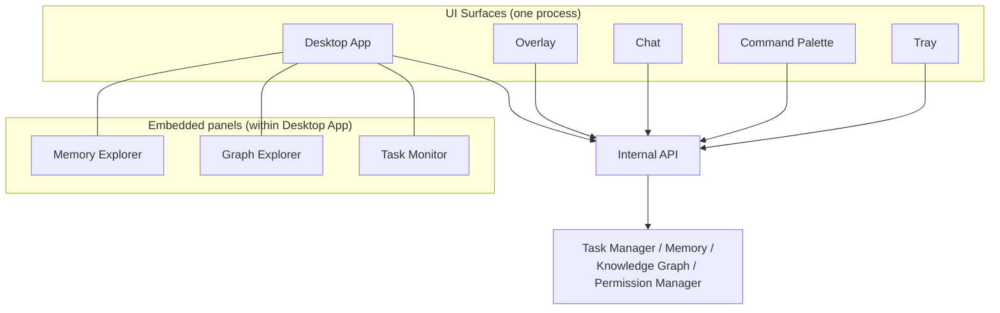

# Diagram: UI Surfaces

## Purpose

Standalone reference showing how NOVA's multiple UI surfaces relate to
one shared backend, complementing the narrative in
`docs/09-ui/ui-overview.md`.

## Source

Authoritative in `docs/09-ui/ui-overview.md`.

## Surface-to-backend relationship

## Reading notes

Every surface connects through the same Internal API to the same
backend state — there is no surface-specific data path, which is the
visual representation of `docs/09-ui/ui-overview.md`'s "one backend, many
surfaces" principle. Memory Explorer, Graph Explorer, and Task Monitor
are drawn as embedded within the Desktop App specifically, per
`docs/09-ui/desktop.md`, though the underlying data they display is
reachable (in condensed form) from lighter-weight surfaces like the
Overlay as well.

## Related documents

- `docs/09-ui/ui-overview.md` — the full specification this diagram
  illustrates
- `docs/08-api/internal-api.md` — the API layer connecting these surfaces
  to the backend
